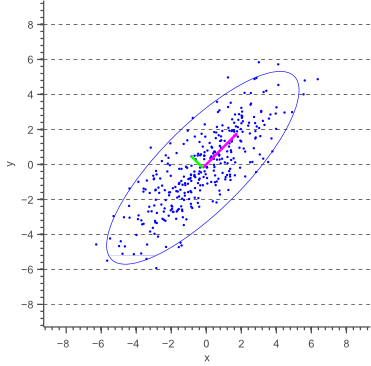

# Projet 3R 

## listes articles : 

- VISUALIZATION OF COVARIANCE AND CROSS-COVARIANCE FIELDS, Chao Yang,1 Dongbin Xiu,2 & Robert M. Kirby
- Visualizing Distributions of Covariance Matrices, Tomoki Tokudaa, Ben Goodrichb, Iven Van Mechelena, Andrew Gelmanb, Francis Tuerlinckxa

## package et fonctions r 

[liste de package](https://analyticsindiamag.com/top-10-r-packages-for-data-visualisation/) for data viz in R

[here](https://mode.com/blog/r-data-visualization-package) another list 

## questions pour bousquet

## Etapes : 

1. Recherche
    - recherche biblio
    - revue de la littérature
    - analyse économique et question de reherche
2. Réalisation
3. Restitution

## Notes Première séance en visio : 

- attention à la rédaction et au plan (voir docs rédaction)
- visualisation en économétrie 
- recensqer les packages ds r pr visualisation n/etat des lieux data viz !!
- partir de la représentation de la covariance 

    1. améliorer représentation covariance 
    2. utiliser résultat comme un moyen pr déterminer des résultats économiques / visualiser méthodes économiques / utiliser cela pour représenter d'autres indicatuers (rho, r², ...)
    3. utiliser résultats pour test économiques / test non linéarité 

    pente estimée par mco s ecrit comme un moyenne de toute le pentes entre tous les poits ( etudier distribution sytitistique de toutes le pentes entre ts les points) /représentation covariance comme sous bassement de représentation d autres indicateurs.

représentation du rectangle qui lie deux lien est une représentation de la covariance . En construisant tous les rectangles du nuage de points et qu on fait la moyenne de ces surfaces, on a exactement la covariance. (à améliorer)

Forme moyenne de tous les rectangles ??? avec surface rectangle moyen (need 1 donnée pr surface avec carré)

carré vert > var de x
carré bleu > variance y 
rectangle > covariance 
1 des cotés du rectangle fixé à valeur ecart type de sigma x / haiteur est rho(coeff corrélation linéaire) X sigma(y)
Que nous apporte ce dessin? 

variance expliquée de y > petit carré bleu 
représentation R²

schéma :
- représentation orthogonale (autre que mcp )
- améliorer représentation de covariance 
- généraliser avec reg lineaire multiple (plusieurs variables explicatives)
    - coeff corrélation partielle, coeff de détermination au lieu de r²

représentation de la décomposition de la variance (X1 explique en partie Y, puis part de X2, .... )
modèles p.600 ds woodridge

départ, article de li > impasse ds représentation en triangle

test : faire varier nb d 'observations 

## Notes 

### COVARIANCE VS. CORRELATION

- Both covariance and correlation measure the relationship and the dependency between two variables.
- Covariance indicates the direction of the linear relationship between variables.
- Correlation measures both the strength and direction of the linear relationship between two variables.
- Correlation values are standardized.
- Covariance values are not standardized.

### Error ellipse

a link to definition and way to draw [error elipse](https://www.visiondummy.com/2014/04/draw-error-ellipse-representing-covariance-matrix/)

### Different way to explain covariance
An [article](https://stats.seandolinar.com/covariance-different-ways-to-explain/) about differents ways to represents covariance
  