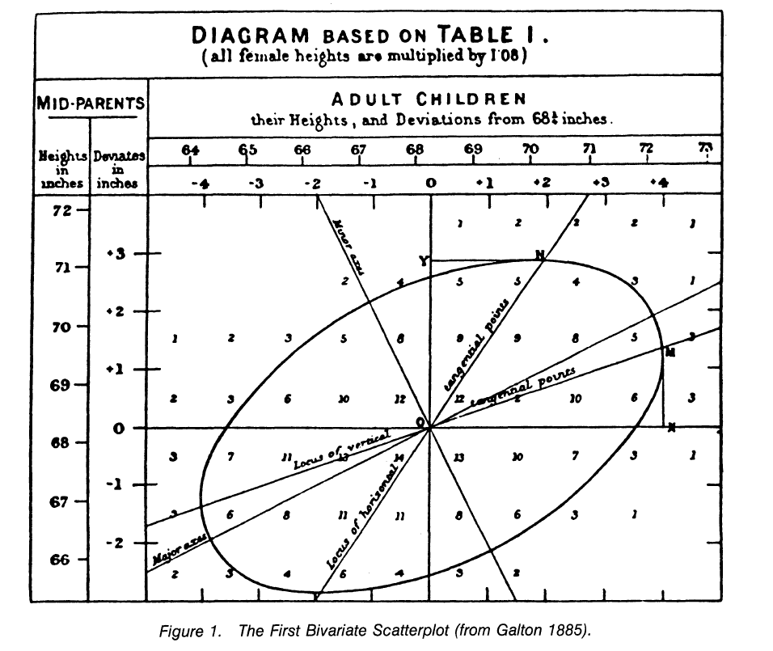

#  Correlation

## From covariance to correlation 

The normalized version of the covariance, the correlation coefficient, however, shows by its magnitude the strength of the linear relation.

- Both covariance and correlation measure the relationship and the dependency between two variables.
- Covariance indicates the direction of the linear relationship between variables.
- Correlation measures both the strength and direction of the linear relationship between two variables.
- Correlation values are standardized.
- Covariance values are not standardized.

The normalized form of the covariance matrix is the correlation matrix.

## Correlation definition  

In statistics, correlation or dependence is any statistical relationship, whether causal or not, between two random variables or bivariate data.

In the broadest sense correlation is any statistical association, though it actually refers to the degree to which a pair of variables are linearly related.

There are several correlation coefficients, often denoted  $\rho$  or $r$, measuring the degree of correlation. The most common of these is the Pearson correlation coefficient, which is sensitive only to a linear relationship between two variables (which may be present even when one variable is a nonlinear function of the other). Other correlation coefficients – such as Spearman's rank correlation – have been developed to be more robust than Pearson's, that is, more sensitive to nonlinear relationships.

## Galton, a pioneer in the history of correlation

>> "I can only say that there is a vast field of topics that fall under the laws of correlation, which lies quite open to the research of any competent person who cares to investigate it." (Galton, 1890)

Galton's 1888 paper, presented to the Royal Society in London, defines correlation as follows:
>>"Two variable organs are said to be co-related when the variation of the one is accompanied on the average by more or less variation of the other, and in the same direction.... It is easy to see that co-relation must be the consequence of the variations of the two organs being partly due to common causes... If they were in no respect due to common causes, the co-relation would be nil."

Galton's definition reveals the properties of the correlation coefficient. It is a measure of the strength of a linear relationship; the closer it is to 1, the more two variables can be predicted from each other by a linear equation. It is a measure of direction: a positive correlation indicates that $X$, $Y$ increase together; a negative correlation indicates that one decreases as the other increases. Note that Galton does not claim that co-relation implies cause and effect (it would be absurd to assume that the size of one organ determines the size of another). Galton hypothesized that the correlation indicated the presence of "common causes" for the observed relationship between the variables (the size of each organ respectively).

More technically Galton continues his presentation as follows:

>>"Let y = the deviation of the subject [in units of the probably error, Q], whichever of the two variables may be taken in that capacity; and let x1, x2, x3, \&c., be the corresponding deviations of the relative, and let the mean of these be X. Then we find: (1) that y = rX for all values of y; (2) that r is the same, whichever of the two variables is taken for the subject; (3) that r is always less that 1; (4) that r measures the closeness of co-relation."

Galton particularly liked the correlation coefficient because it could be used to predict deviations $Y$ from $X$ or $X$ from $Y$. Thus, from the beginning, the correlation coefficient was closely related to the regression line. Originally, $r$ meant the regression slope, but there was a problem in that the regression line of the slope was partly a function of the units of measurement chosen. Galton perceived the correlation coefficient as a unitless regression slope and appropriated the label $r$.

```{r, echo = FALSE}

```

## Thirteen ways to see correlation [@13cor]

> In 1885, Sir Francis Galton first defined the term "regression" and completed the theory of bivariate correlation. A decade later, Karl Pearson developed the index that we still use to measure correlation, Pearson's r . Our article is written in recognition of the 100th anniversary of Galton's first discussion of regression and correlation.

According Joseph Lee Rodgers and co article, Several ways to interpret the correlation:

- As standardized covariance
$$r=\frac{cov(x,y)}{\sigma^2_x\sigma^2_y}$$
- As standardized slope of regression line
$$r=b_{Y.X}(\frac{\sigma^2_x}{\sigma^2_y})=b_{X.Y}(\frac{\sigma^2_y}{\sigma^2_x})$$
- As geometric mean of the two regression slopes}\\
$$r=\pm\sqrt{b_{Y.X}\times b_{X.Y}}$$
- As the square root of  the ratio of two variances}
$$r=\sqrt{\frac{\sum(Y_i -\hat{Y}_i)}{\sum(Y_i -\bar{Y}_i)}}=\sqrt{\frac{SS_{reg}}{SS_{tot}}}$$
- And so many other...

## Pearson correlation coefficient 

- some notations that may be useful:

$S_{xx} = \sum_{i=1}^n(x_i -\bar{x})^2$

$S_{yy} = \sum_{i=1}^n(y_i -\bar{y})^2$

$S_{xy} = \sum_{i=1}^n(x_i -\bar{x})(y_i -\bar{y})$

- Pearson correlation coefficient:

$$\rho=\frac{S_{xy}}{\sqrt{S_{xx}S_{yy}}}$$

The Pearson correlation coefficient is a bounded index (i.e., $-1 \leq \rho \leq 1$) that provides a unitless measure for the strength and direction of the association between two variables.

## Spearman's rank correlation coefficient 

measures the association based on the ranks of the variables.

$$\hat{\theta}=\frac{\sum_{i=1}^n(R_i-\bar{R}(S_i-\bar{S}))}{\sqrt{\sum_{i=1}^n(R_i-\bar{R})^2\sum_{i=1}^n(S_i-\bar{S})^2}}$$

where $R_i$ and $S_i$ are the rank of the $x_i$ and $y_i$ values, respectively.

Note that this is just the estimated Pearson's correlation coeffcient, but the values of the variables have been replaced by their respective ranks.

The Spearman correlation is the non-parametric equivalent of the Pearson correlation. It measures the relationship between two variables. If the variables are ordinal, discrete or do not follow a normal distribution, the Spearman correlation is used. This correlation does not use the values of the data but their rank.
In fact, nothing changes, everything is the same as calculating a Pearson correlation but on transformed variables.
The interest of establishing a correlation on the ranks of the variables is to detect if there is a monotonic relationship, which may not be linear. 

## Partial Correlation 

The partial correlation coefficient, noted here $r_{AB.C}$, allows us to know the value of the correlation between two variables A and B, if the variable C had remained constant for the series of observations considered. 

Put another way, the partial correlation coefficient $r_{AB.C}$ is the total correlation coefficient between variables A and B when we have removed their best linear explanation in terms of C. It is given by the formula :

$$r_{AB.C}=\frac{r_{AB}-r_{AC} \cdot r_{BC}}{\sqrt{1-r_{AC}^2} \cdot \sqrt{1-r_{BC}^2}}$$
Let's go a little further in understanding this coefficient:

The OLS estimator of $\beta$ is written
$$\hat{\beta}=\frac{Cov(y,x_1)}{\mathbb{V}ar(x_1)}$$
The estimator $\beta'$ is written

\begin{align*}
  \hat{\beta'} &= \frac{Cov(y,x_1)\mathbb{V}(x_2)-Cov(y,x_2)Cov(x_1,x_2)}{
  \mathbb{V}(x_1)\mathbb{V}(x_2)-Cov(x_1,x_2)^2} \\
&= \hat{\beta'}=\frac{\rho_{y1} \sigma_y \sigma_1\sigma_2^2-\rho_{y2} \sigma_y     \sigma_2\rho_{12} \sigma_1 \sigma_2}{\sigma_1^2\sigma_2^2-\rho_{12}^2 \sigma_1^2 \sigma_2^2} \\
&= \hat{\beta'}={\frac{\rho_{y1}-\rho_{y2}\rho_{12}} 
{1-\rho_{12}^2}}\quad\frac{\sigma_y}{\sigma_1}
\end{align*}

After some transformation we have: 
$$\hat{\beta'}=\underbrace{\underbrace{\frac{\rho_{y1}-\rho_{y2}\rho_{12}} 
{\sqrt{1-\rho_{12}^2}\sqrt{1-\rho_{y2}^2}}}_{\text{Partial correlation}}}_{\rho_{y1|2}}
\quad\frac{\sigma_y\sqrt{1-\rho_{y2}^2}}{\sigma_1\sqrt{1-\rho_{12}^2}}$$

Pour comprendre cette expression, Consider the following two regressions:
$$x_1=\kappa +\tau x_2+\varepsilon_{1|2}$$  
$$y=\delta +\gamma x_2+\varepsilon_{y|2}$$

We have:
\begin{align*}
Cov(e_{1|2},e_{y|2})&=Cov(x_1-\hat{\kappa}-\hat{\tau} x_2,~y-\hat{\delta} -\hat{\gamma} x_2)\\
&=Cov(x_1,y)-\hat{\gamma}Cov(x_1,x_2)-\hat{\tau}Cov(x_1,y)+\hat{\gamma}\hat{\tau}\mathbb{V}ar(x_2)\\
\mathbb{V}ar(e_{y|2})&=\mathbb{V}ar(y-\hat{\delta} - \hat{\gamma} x_2)\\
&=\mathbb{V}ar(y)-2\hat{\gamma}Cov(x_1,y)+\hat{\gamma}^2\mathbb{V}ar(x_2)\\
\mathbb{V}ar(e_{1|2})&=\mathbb{V}ar(x_1-\hat{\kappa} - \hat{\tau} x_2)\\
&=\mathbb{V}ar(x_1)-2\hat{\tau}Cov(x_1,x_2)+\hat{\tau}^2\mathbb{V}ar(x_2)
\end{align*}

The linear correlation coefficient between $e_{1|2}$ and $e_{y|2}$ corresponds to the correlation between $y$ and $x_1$ after taking into account the linear influence of $x_2$ on these two respective variables:

\begin{align*}
\rho_{yx_1|x_2}&=\frac{Cov(e_{1|2},e_{y|2})}{\sqrt{\mathbb{V}ar(e_{y|2})\mathbb{V}ar(e_{1|2})}}\\
\end{align*}

After simplification we obtain the expression of the partial correlation:

\begin{align*}
\rho_{y1|2}&=\frac{\rho_{y1}-\rho_{y2}\rho_{12}}{\sqrt{(1-\rho_{y2}^2)(1-\rho_{12}^2)}}
\end{align*}


And so, the estimator $\hat{\beta'}$ can thus be written as that of a simple linear regression where the variables are the residuals of prior regressions of $y$ respectively $x_1$ on $x_2$. 

$$\hat{\beta'}=\rho_{y1|2}\frac{\sigma_y\sqrt{1-\rho_{y2}^2}}{\sigma_1\sqrt{1-\rho_{12}^2}}$$

\begin{tikzpicture}
  \draw[<-,thick] (2,1) node[right,state,pattern=dots] (Y) {$y$} -- (0,0) node[left,state] (Y) {$x_2$} node[midway,above] {$\gamma$};
  \draw[<-,thick] (2,-1) node[right,state,pattern=dots] (X1) {$x_1$} -- (0,0) node[left,state] (Y) {$x_2$} node[midway,above] {$\tau$};
  \path[->,ultra thick] (3,-1) edge[bend right=90] node[right]{$\beta'$} (2.9,1);
\end{tikzpicture}

Il peut être assez laborieux de calculer la corrélation partielle lorsque le nombre de variables est plutôt grand. Il est conseillé d'utiliser des techniques de régression lorsque le nombre de variable dépasse 3. L'alternative est de calculer les résidus des régressions des deux variables sur les variables dont on veut purger l'effet. Cette approche permet d'aboutir sur les mêmes résultats car rappelons que la corrélation partielle consiste à mesure le lien entre l'information résiduelle de $X$ et $Y$ qui ne soit pas déjà expliquée par les variables dont on veut enlever l'effet. 
La corrélation d'ordre $j$ revient donc à calculer la corrélation entre les résidus des régressions. 

$$\rho_{xy.z_1, \ldots, z_j} = \rho_{e_xe_y}$$

## Semi partial Correlation

A la différence de la corrélation partielle, la corrélation semi-partielle est résolument asymétrique, elle se rapproche de la régression multiple. On essaie de quantifier le pouvoir explicatif additionnel d'une
variable.

Positionnons nous dans un premier temps dans le cadre à 3 variables $Y$ , $X$, et $Z$ : $Y$ est la variable dépendante que l'on cherche à expliquer, $X$ est la variable explicative que l'on cherche à évaluer, $Z$ est la variable de contrôle. Le carré de la corrélation semi-partielle, notée $r^2_{y(x.z)}$, quantifie la proportion de variance de $Y$ expliquée par $X$, sachant que l'on a retranché de cette dernière l'information apportée par $Z$. En d'autres termes, quelle est la part de $Y$ qu'explique l'information additionnelle de $X$ par rapport à $Z$.
Notons bien la différence avec la corrélation partielle. Avec ce dernier, nous retranchons l'information apportée par $Z$ sur à la fois $Y$ et $X$, et nous mesurons la liaison sur les résidus. Dans le cas de la corrélation semi-partielle, nous cherchons à quantifier la liaison de $Y$ avec la partie résiduelle de $X$ par rapport à $Z$.

\begin{tikzpicture}
  \draw[-] (2,1) node[right,state] (Y) {$y$}  (0,0) node[left,state] (Y) {$Z$};
  \draw[<-,thick] (2,-1) node[right,state,pattern=dots] (X1) {$x$} -- (0,0) node[left,state] (Y) {$Z$} node[midway,above] {$\tau$};
  \path[->,ultra thick] (3,-1) edge[bend right=90] node[right]{$coef$} (2.9,1);
\end{tikzpicture}

La valeur absolue de la corrélation semi-partielle de $X$ avec $Y$ est toujours inférieure ou égale à celle de la corrélation partielle de $X$ avec $Y$. La raison en est la suivante : supposons que la corrélation de $X$ avec $Z$ a été supprimée de $X$, donnant le vecteur résiduel $e_x$ . Lors du calcul de la corrélation semi-partielle, $Y$ contient toujours à la fois une variance unique et une variance en raison de son association avec $Z$. Mais $e_x$, étant non corrélé avec $Z$ , ne peut expliquer qu'une partie de la partie unique de la variance de $Y$ et non la partie liée à $Z$. En revanche, avec la corrélation partielle, seule $e_y$ (la partie de la variance de $Y$ qui n'est pas liée à $Z$) doit être expliquée, il y a donc moins de variance du type que $e_x$ ne peut pas expliquer.

$$r_{y(x.z)}= \frac{r_{yx} - r_{yz}r_{xz}}{\sqrt{1-r^2_{xz}}}$$

Il est évident que si $X$ et $Z$ sont indépendant alors $r_{y(x.z)}= r_{yx}$. De manière contraire, si $X$ et $Z$ sont parfaitement corrélés alors $r_{y(x.z)}$ est indéfinie, il ne reste plus rien dans les résidus de $X$ pour expliquer $Y$. 

## Transitivity correlation

Let $\rho_{xy}$ be the correlation between the variables $X$ and $Y$. Let $\rho_{xz}$ and $\rho_{yz}$ be the correlations of variables $X$ and $Y$ with respect to a third variable $Z$. 

Given $\rho_{xz}$ and $\rho_{yz}$, can we deduce the possible values for $\rho_{xy}$?


$\rho_{XY \mid Z}={\frac {\rho_{XY}-\rho _{XZ}\rho_{YZ}}{{\sqrt {1-\rho_{XZ}^{2}}}{\sqrt {1-\rho_{YZ}^{2}}}}}$

\begin{align*}
  \rho_{XY} 
  &=  \left( \rho_{XY \mid Z} - \frac{ - \rho_{XZ} \rho_{YZ}}{\sqrt{1 - \rho_{XZ}^{2}} \sqrt{1 - \rho_{YZ}^{2}}} \right)  \sqrt{1 - \rho_{XZ}^{2}} \sqrt{1 - \rho_{YZ}^{2}}  \\
  &=  \rho_{XY \mid Z} \sqrt{1 - \rho_{XZ}^{2}} \sqrt{1 - \rho_{YZ}^{2}} +  \rho_{XZ} \rho_{YZ}
\end{align*}

$\rho_{xy}$ is in the range $\rho_{XZ} \rho_{YZ} \pm \sqrt{1 - \rho_{XZ}^{2}} \sqrt{1 - \rho_{YZ}^{2}}$

\begin{align*}
  \rho_{XZ} \rho_{YZ} - \sqrt{1 - \rho_{XZ}^{2}} \sqrt{1 - \rho_{YZ}^{2}} &> 0 \\
  \rho_{XZ} \rho_{YZ} + \sqrt{1 - \rho_{XZ}^{2}} \sqrt{1 - \rho_{YZ}^{2}} &> 0 .
\end{align*}

\begin{align*}
  \rho_{XZ}^2 \rho_{YZ}^2 
  &> \left ( 1 - \rho_{XZ}^{2}\right ) \left (1 - \rho_{YZ}^{2}\right ) \\
  &= 1 - \rho_{XZ}^{2} - \rho_{YZ}^{2} + \rho_{XZ}^2 \rho_{YZ}^2 .
\end{align*}
Si $\rho_{xy}>0$ alors on a 

\begin{align*}
  \rho_{XZ}^2 \rho_{YZ}^2 
  &> \left ( 1 - \rho_{XZ}^{2}\right ) \left (1 - \rho_{YZ}^{2}\right ) \\
  &= 1 - \rho_{XZ}^{2} - \rho_{YZ}^{2} + \rho_{XZ}^2 \rho_{YZ}^2 .
\end{align*}

\begin{equation*}
\text{sign}(\rho_{XY}) 
  =
\begin{cases}
    \text{sign}(\rho_{XZ}) \text{sign}(\rho_{YZ}) & \rho_{XZ}^2 + \rho_{YZ}^2 > 1  \\
    \text{not known} & \rho_{XZ}^2 + \rho_{YZ}^2 \leq 1.
  \end{cases}
\end{equation*}

\begin{tikzpicture}
  \draw [thick,fill=red!80] (0,4) rectangle (4,8);
  \draw [thick,fill=red!80] (4,0) rectangle (8,4);
  \draw [thick,fill=blue!80] (0,0) rectangle (4,4);
  \draw [thick,fill=blue!80] (4,4) rectangle (8,8);
  \draw[ultra thick,green,fill=gray!20] (4,4) circle (4cm);


  \draw[->] (-1,-1) -- (9,-1) node[below] {$\rho_{xz}$} node[below] at(0,-1) {-1} node[below] at(4,-1) {0} node[below] at(8,-1) {1};
  \draw[->] (-1,-1) -- (-1,9) node[left] {$\rho_{yz}$}
node[left] at(-1,0) {-1} node[left] at(-1,4) {0} node[left] at(-1,8) {1};

  \matrix [draw,below left] at (11,8) {
    \node [rectangle,fill=red!80,label=right:$\rho_{xy}<0$] {};\\
    \node [rectangle,fill=gray!20,label=right:$?$] {};\\  
    \node [rectangle,fill=blue!80,label=right:$\rho_{xy}>0$] {};\\
};
%current bounding box.north east
\end{tikzpicture}

## Distance correlation

The so-called association measures are an active and recent field of research that renews the well established and old field of correlation. The *energy* package developed under R as well as Gabor's article [@discor] are good references.

Let $(x_i,y_i)$, $i=1,2, \dots, N$ be a sample of pairs of observations of the variables $X$ and $Y$.

We compute successively

$$dx_{ij}=\lVert x_i-xj \rVert$$
$$dy_{ij}=\lVert y_i-yj \rVert$$

$$\overline{\overline{dx_{ij}}}=dx_{ij}-\overline{dx_{i.}}-\overline{dx_{.j}}+\overline{dx_{..}}$$
$$\overline{\overline{dy_{ij}}}=dy_{ij}-\overline{dy_{i.}}-\overline{dy_{.j}}+\overline{dy_{..}}$$
with

$\overline{dx_{i.}}=\frac{1}{N}\sum_{j=1}^{N} dx_{ij}$

and

$\overline{dx_{..}}=\frac{1}{N^2}\sum_{i=1}^{N}\sum_{j=1}^{N} dx_{ij}$


$$dCov(X,Y)=\frac{1}{N^2}\sum_{i=1}^{N}\sum_{j=1}^{N}
\overline{\overline{dx_{ij}}}~ 
\overline{\overline{dy_{ij}}}$$


$$dVar(X)=dCov^2(X,X)=\frac{1}{N^2}\sum_{i=1}^{N}\sum_{j=1}^{N} 
\overline{\overline{dx_{ij}}}~^2$$


$$d\rho=\frac{dCov(X,Y)}{d\sigma_X~d\sigma_Y}$$


**note bousquet : expliquer, commenter, représenter, tester sur un exmple, appliquer le package R, +bootstrap pour intervalles de confiance**

## Other Correlations 

On ne compte plus le nombre de correlation. Voici quelques d'entre eux: 

\begin{itemize}[label=\textbullet]
    \item Biweight midcorrelation (Langfelder \& Horvath, 2012) : c'est une mesure de la relation entre variables basée sur la médiane, et non sur la moyenne. Elle est donc moins sensible aux valeurs aberrantes. Elle est souvent utilisé comme alternative robuste au coefficient de corrélation linéaire de Pearson. 
    \item Percentage bend correlation : Introduite par Wilcox en 1994, elle est basée sur une pondération descendante d'un pourcentage spécifié d'observations marginales s'écartant de la médiane (par défaut, 20\%).
    \item Shepherd’s Pi correlation : elle est équivalente au à la corrélation de rang de Spearman aprés avoir supprimé les valeurs aberrantes. Ici, une valeur aberrante est définie au moyen de la distance de Mahalanobis bootstrap). 
    \item Point-Biserial and biserial correlation : ces coefficients s'utilise lorsque une variable est continue et l'autre est dichotomique. Tandis que la point-biserial correlation est similaire à la corrélation de Pearson, la biserial correlation doit-être utilisé lorsque la variable dichotomique peut avoir une dimension continue sous-jacente. Par exemple, la réussite d'un semestre peut être exprimé en note, mais peut aussi être classé "Réussite" ou "Echec".  
    \item Polychoric and tetrachoric : la polychoric correlation est la corrélation entre deux variables latentes continues théoriquement distribuées, à partir de deux variables ordinales observées. La tetrachoric correlation est un cas particulier applicable lorsque les deux variables observées sont dichotomiques. 
    \item Blomqvist’s coefficient (Blomqvist, 1950) : également appelé Blomqvist’s Beta ou medial correlation, c'est un coefficient de corrélation non paramétrique basée sur la médiane. Il a un avantage par rapport à certaines mesures comme les estimations de Spearman ou de Kendall %pourquoi ? à détailler 
    \item Hoeffding’s D : la statistique D de Hoeffding est une mesure d'association non paramègtrique basée sur le rang. Il détecte les écart plus génééraux par rapport à l'indépendance y compris les associations non linéaires. Cette métrique est compris entre -0,5 et 1.
    \item Gamma correlation : La statistique gamma de Goodman Kruskal est similaire au coefficient $\tau$ de Kendall. Il est relativement robuste aux valeurs aberrantes et traite bien les données qui ont de nombreux liens. 
    \item Gaussian rank correlation (Boudt et al., 2012) : il est une alternative simple et performante pour des corrélations de rang robustes. Il est basé sur les quantiles gaussiens des rangs.
    \item Winsorized correlation : C'est une corrélation basée sur les variables transformées. La transformation dite "winsorisées" limite les valeurs extrêmes pour réduire l'effet des valeurs aberrantes éventuellement fausses. 

