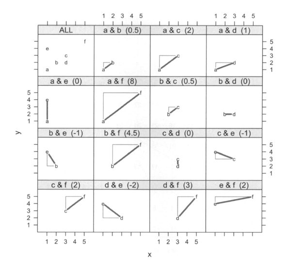

# Vizualization of covariance and correlation

## Différentes tentatives pour représenter la covariance

### A Geometrical Interpretation of an Alternative Formula for the Sample Covariance

Kevin Hayes [@Hayes] propose une nouvelle interprétation géométrique et visuelle de la covaraiance, à partir de l'application de la formule de la variance poposée par Hefferman. Il étend cette formule à la covariance d'un échantillon pour extraire ses résultats. 

- formula from heffernan definition of covariance : 

$$cov(X,Y)= \frac{2}{n(n-1)}\sum_{i=1}^{n-1}\sum_{j>i}^{n}\frac{1}{2}(x_i-x_j)(y_i - y_j)$$

Geometrically, $\frac{1}{2}(x_i-x_j)(y_i - y_j)$ is ±1 times the area right-triangle formed with the difference vector $(x_i — x_j, y_j)$ as its hypotenuse, where negatively sloped difference tors incur a $(—1)$ sign and positively sloped difference vectors take a $(+1)$ sign. [@Hayes]

***A détailler et reformuler***

```{r, echo = FALSE}

```

## Covariance as Signed Area of Rectangles : 

Cet article [@Chudzicki] a été écrit suite à une conversation trrès intéressante sur le site **stats.statckexchange** (https://stats.stackexchange.com/questions/18058/how-would-you-explain-covariance-to-someone-who-understands-only-the-mean.) Le sujet initial de cette conversation était : comment expliquer la covariance à quelqu'un qui ne comprends que la notion de moyenne?  

mode d'emploi : 

- Draw all possible such rectangles. Color them transparently, making the positive rectangles red (say) and the negative rectangles "anti-red" (blue).
- The covariance is the net amount of red in the plot (treating blue as negative values).

"Let's deduce some properties of covariance. Understanding of these properties will be accessible to anyone who has actually drawn a few of the rectangles. :

- Bilinearity. 

Because the amount of red depends on the size of the plot, covariance is directly proportional to the scale on the x-axis and to the scale on the y-axis.

- Correlation. 

Covariance increases as the points approximate an upward sloping line and decreases as the points approximate a downward sloping line. This is because in the former case most of the rectangles are positive and in the latter case, most are negative.

- Relationship to linear associations. 

Because non-linear associations can create mixtures of positive and negative rectangles, they lead to unpredictable (and not very useful) covariances. Linear associations can be fully interpreted by means of the preceding two characterizations.

- Sensitivity to outliers. 

A geometric outlier (one point standing away from the mass) will create many large rectangles in association with all the other points. It alone can create a net positive or negative amount of red in the overall picture."

```{r, echo = FALSE}
knitr::include_graphics("covRect.PNG")
```

## Notre projet : le package plotnetrec

Une part du package que nous en sommes en train de développer est de présenter différentes représentations de la covariance. 

***mettre schémas de représentation covariance issu de pltnetrec avec explications***

