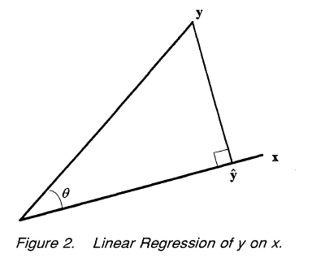
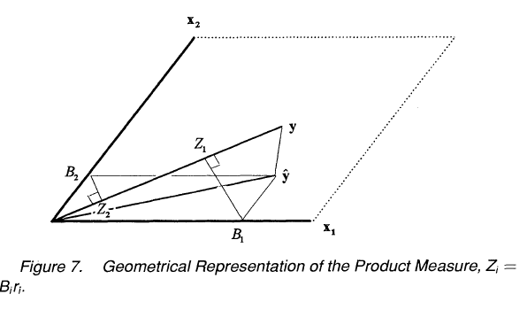
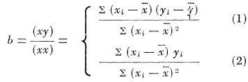
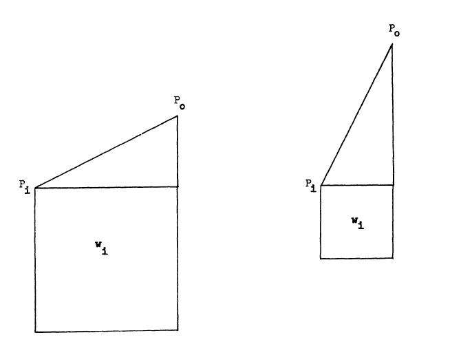

# Reoprésentation de la régression linéaire 

## Etat des lieux de la visualisation de la régression

### More on Venn Diagrams for Regression

Kennedy [@kennedy] extended the Venn diagram to the exposition of bias and variance in the context of the classical linear regression (CLR) model, written as y = Xb + e .

*A compléter*

### A Geometric Approach to Compare Variables in a Regression Model

He proposes [@Bring] a geometric approaches to compare variables in a regression model. 

> This article gives a brief introduction to the geometric approach in regres- sion analysis, and then geometry is used to shed some light on the problem of comparing the "importance" of the in- dependent variables in a multiple regression model. Even though no final answer of how to assess variable impor- tance is given, it is still useful to illustrate the different measures geometrically to gain a better understanding of their properties.

```{r, echo = FALSE}

```

```{r, echo = FALSE}

```

*A compléter*

### Two Additional Views of Linear Regression Coefficients

The author [@Cli] proposes an interesting interpretation of the slope in the keast square method. The linear regression line of y on x, as determined by the method of least squares, passes through the central point with slope:

```{r, echo = FALSE}

```

- As a weighted average slope.

> This concept of weight for a slope is represented in the accompanying diagrams. (See Figure 1). The slope in the lefthand side diagram has a much larger weight than that in the righthand side for regression of y on x. If we were concerned with the regression of x on y, the reverse would be true. Note that the actual distance between the two points in the two diagrams is the same.

```{r, echo = FALSE}

```

- As a contrast

*A détailler ... ou pas ...

### Covariance and regression diagram

Notre point de départ pour ce package est le travail réalisé par notre professeur [@bousquet]

*schémas LS à insérer*


## Notre projet: le package plotnetrec

